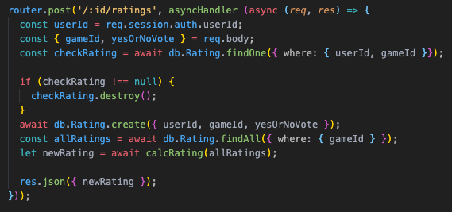

<!-- PROJECT SHIELDS -->
<!--
*** I'm using markdown "reference style" links for readability.
*** Reference links are enclosed in brackets [ ] instead of parentheses ( ).
*** See the bottom of this document for the declaration of the reference variables
*** for contributors-url, forks-url, etc. This is an optional, concise syntax you may use.
*** https://www.markdownguide.org/basic-syntax/#reference-style-links
-->


<!-- PROJECT LOGO -->
<br />
<p align="center">
  <a href="https://github.com/RoodeAwakening/GoodGames">
    
  </a>

  <h3 align="center">GoodGames</h3>

  <p align="center">
    GoodGames is an game cataloging website that allows individuals to rate, comment on, and browse video games of all types. Users can sign up and register to add games to their Game Center to let others know what games they want to play, what they are currently playing, and what they have already played.
    <br />
    <a href="https://github.com/RoodeAwakening/GoodGames"><strong>Explore the docs »</strong></a>
    <br />
    <br />
    <a href="https://goodgames-a.herokuapp.com/login/demo">View Demo</a>
    ·
    <a href="https://github.com/RoodeAwakening/GoodGames/issues">Report Bug</a>
    ·
    <a href="https://github.com/RoodeAwakening/GoodGames/issues">Request Feature</a>
  </p>
</p>


<!-- TABLE OF CONTENTS -->
<details open="open">
  <summary><h2 style="display: inline-block">Table of Contents</h2></summary>
  <ol>
    <li>
      <a href="#about-the-project">About The Project</a>
      <ul>
        <li><a href="#built-with">Built With</a></li>
      </ul>
    </li>
    <li>
      <a href="#getting-started">Getting Started</a>
      <ul>
        <li><a href="#prerequisites">Prerequisites</a></li>
        <li><a href="#installation">Installation</a></li>
      </ul>
    </li>
    <li><a href="#usage">Usage</a></li>
    <li><a href="#roadmap">Roadmap</a></li>
    <li><a href="#contributing">Contributing</a></li>
    <li><a href="#license">License</a></li>
    <li><a href="#contact">Contact</a></li>
    <li><a href="#acknowledgements">Acknowledgements</a></li>
  </ol>
</details>


<!-- ABOUT THE PROJECT -->
## About The Project

[Click here to view GoodGames live on the web!](https://goodgames-a.herokuapp.com/login)
<br>
</br>


### Built With

* [JavaScript]()
* [Pug]()
* [HTML]()
* [CSS]()


<!-- GETTING STARTED -->
## Getting Started

To get a local copy up and running follow these simple steps.

### Prerequisites

Here is everything we need you to do to get started with GoodGames.
* npm
  ```sh
  npm install npm@latest -g
  ```

### Installation

1. Clone the repo
   ```sh
   git clone https://github.com/RoodeAwakening/GoodGames
   ```
2. Install NPM packages
   ```sh
   npm install
   ```
3. Add a '.env' with your environment variables to the root of your local directory

4. Create a postgreSQL user
    ```sh
    CREATE USERS <<your username>> WITH PASSWORD <<your password>> CREATEDB
    ```
5. Create your database
    ```sh
    npx dotenv sequelize db:create
    ```
6. Migrate and seed your database
    ```sh
    npx dotenv sequelize db:migrate
    npx dotenv sequelize db:seed:all
    ```

<!-- USAGE EXAMPLES -->
## Usage
### An easy-to-use login with a pre-configured Demo User.

### A plethora of games to view.

### Review, comment and add to your game center.

### Game center where you can view all of your games and comments.


_For more examples, please refer to the [Documentation](https://example.com)_

## Obstacles

### Rating API

We noticed that we needed to calculate the user rating for each game in a number of places, so we decided it would be best to implement a calcRating helper function. This allows us to keep our code clean and precise.

Helper Function (calcRating):
<br>
</br>

<br>
</br>
API Route Example Usage:
<br>
</br>


### User Game Status Persistance

Depending on how a user has a specific game catorized in their game center, we wanted the chosen (red) status button to persist when they navigate back to that specific game page. This required figuring out a solution to prevent the previous game status after the user had changed that status.


<!-- ROADMAP -->
## Roadmap

See the [open issues](https://github.com/RoodeAwakening/GoodGames/issues) for a list of proposed features (and known issues).


<!-- CONTRIBUTING -->
## Contributing

Contributions are what make the open source community such an amazing place to be learn, inspire, and create. Any contributions you make are **greatly appreciated**.

1. Fork the Project
2. Create your Feature Branch (`git checkout -b feature/AmazingFeature`)
3. Commit your Changes (`git commit -m 'Add some AmazingFeature'`)
4. Push to the Branch (`git push origin feature/AmazingFeature`)
5. Open a Pull Request


<!-- CONTACT -->
## Contact & Acknowledgements

* Derek Roode - [LinkedIn](https://www.linkedin.com/in/derek-roode-9014a796/) - [GitHub](https://github.com/RoodeAwakening)
* Ted Anton - [LinkedIn](https://www.linkedin.com/in/ted-anton/) - [GitHub](https://github.com/tedjanton)
* Rob Whitacre - [LinkedIn](https://www.linkedin.com/in/rob-whitacre-825434113/) - [GitHub](https://github.com/RobWhit5113)

Project Link: [https://github.com/RoodeAwakening/GoodGames](https://github.com/RoodeAwakening/GoodGames)


<!-- ACKNOWLEDGEMENTS -->
